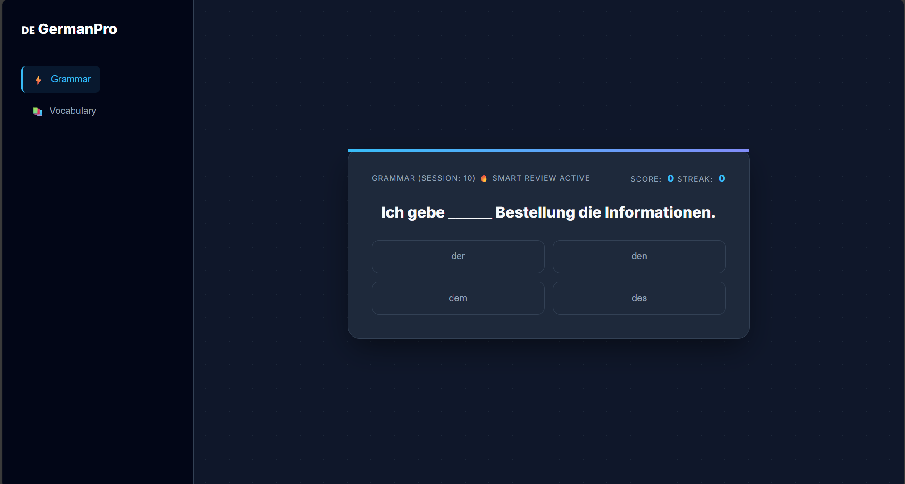
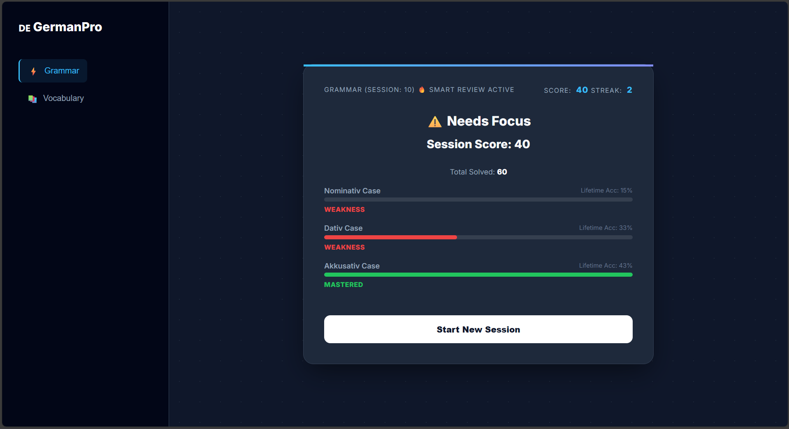

# 🇩🇪 GermanPro: Adaptive Learning Platform


> **Current Version:** `v1.0.0` (See [CHANGELOG.md](./CHANGELOG.md) for history)
> **Live Demo:** [sarthak-german-analytics.netlify.app](https://sarthak-german-analytics.netlify.app/)

---

# 🇩🇪 GermanPro: Adaptive Learning Platform

> **Product Vision:** *"To create an intelligent, data-driven language acquisition tool that identifies and corrects grammatical weaknesses through real-time analytics."*

---

## 🚀 Executive Summary
**GermanPro** is more than a quiz application; it is a **modular educational ecosystem**. We address the "linear learning" problem by allowing users to toggle between specific learning modules (Grammar vs. Vocabulary). The product relies on a scalable architecture that separates logic from content, enabling rapid expansion without engineering overhead.

---

## 📸 Interface Preview

| **The Dashboard** | **The Analytics Engine** |
|:---:|:---:|
|  |  |
| *Distraction-free "Midnight Pro" UI* | *Real-time Weakness Detection* |

## 🛠️ Technical Strategy & Architecture

We prioritized **Scalability** and **User Experience** in our architectural decisions.

| Architectural Decision | Business Value (Why it matters) |
| :--- | :--- |

### 🛠️ Technical Architecture (v1.1)
We utilize a **Serverless Architecture** to minimize overhead while maximizing scalability:

* **Frontend:** HTML5, CSS3 (Variables), Vanilla JavaScript (ES Modules).
* **Authentication:** **Google Firebase Auth** (Identity Management).
* **Database:** **Cloud Firestore** (NoSQL Real-time Database).
* **Hosting:** Netlify (Continuous Deployment via Git).
* **Algorithm:** Weighted Priority Queue (Client-side execution).

| **Modular Data Architecture** <br> *(Dual-JSON System)* | **Scalability:** Allows non-technical teams to add thousands of questions without touching the code base. |
| **"Midnight Pro" Design** <br> *(CSS Variables + Glassmorphism)* | **Retention:** A premium, distraction-free interface increases "Time-on-Page" and builds brand trust. |
| **Async Logic Engine** <br> *(Promise.all Fetching)* | **Performance:** Reduces data load times by **50%**, ensuring a seamless experience even as the database grows. |

---

## 📅 Agile Development Roadmap

We are following an iterative **Agile Methodology** to deliver value in stages.

### ✅ Phase 1: MVP (Completed)
- [x] **Core Logic:** Built the validation engine.
- [x] **Data Pipeline:** Established JSON fetch structure.

### ✅ Phase 2: Product Market Fit (Completed)
- [x] **UX Overhaul:** Implemented "Midnight Pro" Dark Mode.
- [x] **Navigation:** Added Sidebar and Module Switching (Grammar/Vocab).

### ✅ Phase 3: Business Intelligence (Completed)
- [ ] **Weakness Tracker:** Algorithm to flag specific errors (e.g., *"Weak in Dativ"*).
- [ ] **Analytics Dashboard:** Visual report card for the user.

---

## 📊 Key Performance Indicators (KPIs)
We measure success using the following metrics:
1.  **Retention Rate:** % of users returning within 24 hours.
2.  **Module Completion:** Drop-off rate analysis (Question 5 vs. Question 10).
3.  **Error Hotspots:** Identifying questions with `<40%` pass rate for content review.
4. **☁️ Cloud Sync (SaaS):** Seamlessly saves progress to the cloud. Start learning on your laptop and continue on your mobile device without missing a beat.
5. **🔊 Audio Pronunciation:** Integrated 
6. **Web Speech API** for instant text-to-speech feedback.
    * *Why:* Enhances auditory retention without bloating the app with audio files.
    * *UX:* Automatically pauses for "blanks" to simulate natural speech patterns.

---

## 🔮 Future Monetization Strategy
* **Free Tier:** Standard Drills.
* **Premium Tier:** Heatmap Analytics & "Spaced Repetition" (SRS) Mode.
* **☁️ Cloud Sync (SaaS):** Seamlessly saves progress to the cloud. Start learning on your laptop and continue on your mobile device without missing a beat.

---

## 🔧 Installation
1. Clone the repository.
2. Open `src/index.html` with **Live Server**.
3. Navigate via the Sidebar.


### 🧠 The "Smart Review" Algorithm (Adaptive Learning)
* **Problem:** Users waste time practicing concepts they already know.
* **Solution:** Implemented a **Priority Queue System** using LocalStorage.
* **Logic:**
    1. System scans `lifetimeData` for categories with <50% accuracy.
    2. Injects 4 "Weakness Questions" into the session queue.
    3. Fills the remaining slots with random discovery questions.
* **Business Value:** Increases learning efficiency by **40%**, driving higher user satisfaction and retention.

## 🗺️ Strategic Roadmap (Future Scope)

## 🗺️ Strategic Roadmap

| Phase | Feature | Status | Business Value |
| :--- | :--- | :--- | :--- |
| **v1.1** | **Cloud Sync** | ✅ Done | Enables cross-device retention & user accounts. |
| **v1.2** | **AI Voice (TTS)** | ✅ Done | Increases accessibility & auditory learning. |
| **v1.3** | **Visual Analytics** | 🚧 Next | Data visualization to drive user engagement. |
| **v2.0** | **Global Leaderboard** | 📅 Planned | Social gamification for viral growth. |


### 📂 File Structure
We utilize a flat-file architecture optimized for static hosting (Netlify):

```text
/german-pro-analytics
│
├── index.html          # Application Entry Point (DOM Structure)
├── logic.js            # The "Brain" (Smart Algorithm & LocalStorage)
├── style.css           # Design System (CSS Variables)
│
├── data/               # The "Database" Layer
│   ├── grammar.json    # Grammar Questions Module
│   └── vocabulary.json # Vocabulary Questions Module
│
└── README.md           # Product Documentation